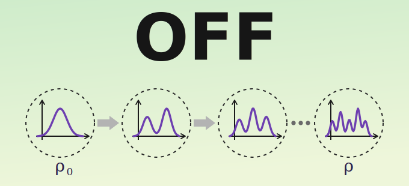

<p align="center">
  
</p>

# OFF: An Orbital-Free Density Functional Theory Python library using Normalizing Flows

OFF is a [JAX](https://github.com/google/jax)-based library for **orbital-free density
functional theory (OF-DFT)** in which the electron density is represented by a
**continuous normalizing flow (CNF)** and the ground-state energy is obtained by
*variationally minimizing* a density functional with Monte-Carlo gradient estimates.
The density is normalized by construction (it is a probability flow), and the physical
density is recovered as `ρ(x) = Ne · ρ_φ(x)`.

OFF is built entirely on the JAX ecosystem — automatic differentiation, JIT
compilation, vectorization, and GPU acceleration — with
[Diffrax](https://github.com/patrick-kidger/diffrax) for the flow ODEs,
[Equinox](https://github.com/patrick-kidger/equinox) for the models and functionals,
[Distrax](https://github.com/google-deepmind/distrax) for the base distribution, and
[Optax](https://github.com/google-deepmind/optax) for the optimization.

## Functionality

The current version of the library has the following capabilities: 

* Provides an implementation of OF-DFT methods with continuous normalizing flows. 
* A modular library of density functionals:
  * **kinetic**: Thomas–Fermi, von Weizsäcker, and TF-λW;
  * **exchange**: LDA and B88;
  * **correlation**: VWN96 and PW92;
  * **nuclear attraction**, 
  * **Hartree**, and 
  * **nuclear-cusp corrections** (Kato, Hutcheon).
* Two base (prior) distributions for the flow: an analytic **promolecular** density
  (no extra dependencies) and an **`atom_db`** prior built from
  [AtomDB](https://atomdb.qcdevs.org/api/index.html) atomic densities — install AtomDB
  only if you use that prior.
* Evaluates density functionals using Monte Carlo estimators. 
* In addition to Monte Carlo estimators, it also has a deterministic **grid (quadrature) readout** of the energy after training, using a
  [PySCF](https://github.com/pyscf/pyscf) Becke grid converted to `jax.Array`.

## Install

From PyPI:

```bash
pip install off
```

or from a clone of the repository (add `-e` for an editable install):

```bash
git clone https://github.com/AlexandreDeCamargo/of_flows.git
cd of_flows
pip install -e .
```

The base install is **CPU-only** and works on every platform. For an **NVIDIA GPU**
(CUDA 12), add the `gpu` extra:

```bash
pip install "off[gpu]"
```

JAX then runs on the GPU automatically when one is available and falls back to the CPU
otherwise — no code changes needed.

## Use

Two stages: (1) **train** a normalizing flow for a given molecule and functional, then
(2) read out the energy on a **quadrature grid**. Both are exposed as command-line
tools (after `pip install -e .`) and as a Python API.

### 1. Train a flow

```bash
off-train --mol_name H2 --bond_length 1.4 \
          --kin tf_w --lam 1/5 --x lda_b88_x --c none \
          --hart coulomb --prior promolecular \
          --solver dopri8 --epochs 500 --bs 512
```
(equivalently `python -m off.main ...`). This minimizes the OF-DFT energy with the
Monte-Carlo estimator and writes everything under a method-tagged directory:

```
Results/H2/tf_w_lam0.2_none_lda_b88_x_none_dopri8_promolecular_sched_mix/bl_1.40/
    Checkpoints/checkpoint_*.eqx     # the trained flow
    training_metrics_ema.csv         # EMA energy trace
    job_params.json                  # everything needed to rebuild the run
```

Key options: `--kin {tf,w,tf_w}`, `--x {lda,b88_x,lda_b88_x}`, `--c {vwn_c,pw92_c,none}`,
`--cc {kato,hutcheon,none}`, `--hart {coulomb,coulomb_}` (all-pairs / element-wise),
`--prior {promolecular,atom_db}`, `--solver {dopri5,tsit5,dopri8}`.

### 2. Evaluate the energy on a grid

After training, point the quadrature tool at the run directory. It rebuilds the flow
from `job_params.json`, builds a PySCF grid, evaluates `ρ_φ` and its score there, and
integrates every energy term:

```bash
off-quadrature Results/H2/tf_w_lam0.2_none_lda_b88_x_none_dopri8_promolecular_sched_mix/bl_1.40 --grid_level 3
```
(equivalently `python -m off.quadrature ...`). It prints the per-term energies
(`T, V_N, V_H, E_X, E_C, E_CC, E_NN, E_total`) and the `∫ρ` check, and caches the
result in `energy_summary.json`. The same call from Python:

```python
from off import grid_energy_from_checkpoint

e = grid_energy_from_checkpoint(
    "Results/H2/.../bl_1.40", grid_level=3)
print(e["E_total"], e["Ne_integral"])
```

### Build a grid

```python
from off import getGrid

h2_geom = "H 0 0 0; H 0 0 1.4"               
w_grid, x_grid = getGrid(h2_geom, level=3, units="bohr")
```

## Examples

Worked Jupyter notebooks are in [`Examples/`](Examples/):

* [`H2_training.ipynb`](Examples/H2_training.ipynb) — train a normalizing flow for
  H₂ from scratch (energy convergence, density along the bond, normalization check).
* [`H2_loading_quadrature.ipynb`](Examples/H2_loading_quadrature.ipynb) — reload a
  trained run and evaluate the grid (quadrature) energy.

## Package layout

```
off/
  main.py            # training entry point   (off-train)
  quadrature.py      # grid-energy readout    (off-quadrature)
  flow/              # the continuous normalizing flow (CNF)
  ode_solver/        # Diffrax forward/reverse ODE solves
  promolecular/      # base distributions (promolecular, AtomDB)
  functionals/       # kinetic, exchange-correlation, nuclear, Hartree, cusp
  train/             # loss (Monte-Carlo energy) and the optimization loop
```

## Citation

```bibtex
@article{deCamargo:MLST:2024,
doi = {10.1088/2632-2153/ad7226},
url = {https://doi.org/10.1088/2632-2153/ad7226},
year = {2024},
month = {sep},
publisher = {IOP Publishing},
volume = {5},
number = {3},
pages = {035061},
author = {de Camargo, Alexandre and Chen, Ricky T Q and Vargas-Hernández, Rodrigo A},
title = {Leveraging normalizing flows for orbital-free density functional theory},
journal = {Machine Learning: Science and Technology},
}


@article{off,
  title  = {OFF: An Orbital-Free Density Functional Theory Python library using Normalizing Flows},
  author = {de Camargo, Alexandre and A. Vargas-Hernández, Rodrigo},
  year   = {2026},
}
```
